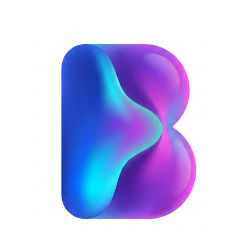

[English](README.md) | [Español](README.es.md) | [Français](README.fr.md) | [Nederlands](README.nl.md) | [Português](README.pt.md) | [Русский](README.ru.md) | [简体中文](README.zh-CN.md) | [日本語](README.ja.md) | [한국어](README.ko.md) | [Bahasa Indonesia](README.id.md) | [Bahasa Melayu](README.ms.md)

<p align="center"></p>

# BiblioFuse NAS

Docker と Synology NAS 向けの、プライベートなセルフホスト型電子書籍・コミックライブラリです。[BiblioFuse ウェブサイト](https://bibliofuse.com)

## 無料のホスティングとブラウザ読書

BiblioFuse NAS は Docker または Synology Container Manager で無料でホストでき、Web ライブラリとリーダーも無料です。この公開配布リポジトリにはインストール用ファイルと文書だけが含まれ、サーバーのソースコードは含まれません。

## 製品の状態

| ホストまたはクライアント | 提供状況 | 読書・接続サポート |
| --- | --- | --- |
| Docker / Synology Container Manager | 公開ベータ `0.1.7` | 無料サーバー、ブラウザ UI、ローカル Wi-Fi ネイティブ配信 |
| BiblioFuse Web リーダー | 同梱 | CBZ、ZIP、CBR、RAR、EPUB、TXT、TEXT、Markdown |
| Docker 対応の iOS / visionOS アプリ | ローカル Wi-Fi | Bonjour 検出とピン留め HTTPS。Premium はネイティブアプリ側で適用 |
| Synology Package Center アプリ（`.spk`） | 公開 x86-64 リリース | 非 root パッケージ。既存 DSM 共有フォルダへの読み取り専用アクセスを案内 |
| Synology アプリからの iOS / visionOS 配信 | ローカル Wi-Fi | Bonjour 検出とピン留め HTTPS。Premium はネイティブアプリ側で適用 |
| BiblioFuse Mac / PC ホスト | 別製品 | 最も滑らかなネイティブ配信を優先する場合に推奨 |

Docker とブラウザリーダーは無料です。ネイティブ配信は同じローカル Wi-Fi 上の iOS/visionOS アプリの Premium 機能です。

## ブラウザの言語

ブラウザアプリはシステム言語に従うか、設定で英語、スペイン語、フランス語、オランダ語、ポルトガル語、ロシア語、簡体字中国語、日本語、韓国語、インドネシア語、マレー語を選べます。この選択はブラウザ内だけに保存され、サーバー設定、ライブラリメタデータ、ネイティブクライアントは変更しません。

## パフォーマンスの目安

常時稼働 NAS は便利で省電力ですが、コミック/アーカイブのページ準備は通常、現代の Mac/PC より遅くなります。Mac/PC は滑らかなネイティブ読書向け、NAS は常時利用できる個人ライブラリ向けです。CPU は索引、展開、サムネイル、次ページ準備に影響します。SSD/NVMe はコールドアクセスと繰り返しアクセスを改善できますが、低消費電力 NAS CPU をデスクトップ CPU 相当にするものではありません。連続コミックではページが順次読み込まれるため、未キャッシュの次ページで短い間隔が生じることがあります。サーバーは準備済みページをキャッシュし、次ページを先読みします。

## 始める前に

64 ビット Intel/AMD または ARM64 の Docker Compose ホスト、または Container Manager 対応 Synology、永続 config フォルダ、破棄可能な cache フォルダ、書籍フォルダ、TCP ポート `7343` が必要です。Synology の例：

```text
/volume1/docker/bibliofuse/config
/volume1/docker/bibliofuse/cache
/volume1/books
```

パスは異なって構いません。BiblioFuse が書籍フォルダへの書き込みを必要とすることはありません。

## Docker Compose でインストール

1. このリポジトリから `docker/compose.yaml` と `docker/.env.example` を取得し、後者を `.env` にコピーします。
2. `CONFIG_PATH`、`CACHE_PATH`、`LIBRARY_PATH`、`PUID`、`PGID`、`BF_TIME_ZONE` を設定します。`LIBRARY_PATH` は自分のホストフォルダです。
3. 起動します。

```sh
docker compose up -d
```

4. `http://<server-ip>:7343` を開き、最初の管理者を作成します。設定で **Attach library** を開き、表示された **Library** またはサブフォルダを選択して **Refresh** を選びます。

Compose は選択した `LIBRARY_PATH` を **Library** として公開するだけです。新規インストールでは自動的にフォルダを接続しません。詳しくは [Docker インストールガイド](docs/docker-install.ja.md) を参照してください。

## Synology Container Manager でインストール

`synology/compose.yaml` を Container Manager プロジェクトとして使い、変数に絶対 Synology パスを設定して起動します。

```text
http://<nas-ip>:7343
```

このプロジェクトは DSM `/volume1` を読み取り専用でマウントし、選択した `PUID`/`PGID` が実際に読める共有フォルダだけを一覧にします。管理者が設定で選ぶまでフォルダは接続されません。config と cache は書き込み可能である必要があります。ライブラリは設定で変更、無効化、切り離しできます。切り離しはそのルートのカタログ、メタデータ、読書位置を消去しますが、書籍は削除しません。完全な手順は [Synology チュートリアル](docs/synology-container-manager.ja.md) を参照してください。同一 NAS で Docker プロジェクトとネイティブパッケージを同時に実行しないでください。両者は `7342` と `7343` を使用します。

## ネイティブ Synology パッケージ

汎用 x86-64 パッケージは制限された DSM アカウント `BiblioFuseNAS` で動作し、ライブラリを作成・移動・想定しません。設定は既存共有フォルダに読み取り専用権限を与える方法を案内し、ピッカーには実際に読める共有だけが表示されます。[ネイティブ Synology パッケージガイド](docs/synology-package.ja.md) を参照してください。

## 更新、形式、安全性

**Refresh** はフォルダツリー全体で追加、削除、名前変更を確認し、新規/変更済み書籍だけを再索引します。自動更新は初期状態で無効で、毎日または毎週を選べます。時刻は `BF_TIME_ZONE` を使います。Web リーダーは CBZ/ZIP/CBR/RAR、EPUB、TXT/TEXT/Markdown をサポートし、PDF は未対応です。最初の管理者パスワードは 12 文字以上にしてください。`7343` はブラウザ UI であり、信頼できる LAN または HTTPS リバースプロキシの背後に置き、ルーターポート転送で公開しないでください。`7342` はピン留めネイティブクライアント HTTPS API、`7341` は予約済みで公開してはいけません。

## バックアップ、更新、ダウンロード

永続 config フォルダ全体をバックアップします。cache は破棄可能で、ライブラリは自分の NAS/ホストフォルダに残ります。更新前に設定から BiblioFuse バックアップをダウンロードし、config のコピーを保持します。

```sh
docker compose pull
docker compose up -d
```

同じ config フォルダをマウントしたままなら、コンテナの再作成でアカウントやカタログは削除されません。ライブラリの切り離しは、そのルートのカタログ、注釈、読書位置を消去します。

- **Docker イメージ：** `ghcr.io/mlt-solutions/bibliofuse-nas:0.1.7`
- **Docker / Container Manager テンプレート：** このリポジトリ
- **リリースノートとダウンロード：** GitHub Releases
- **Synology `.spk`：** GitHub Releases（`x86-64` DSM 7）
- **製品概要とネイティブアプリ：** [bibliofuse.com](https://bibliofuse.com)

Docker イメージは公開ベータです。両方式はローカル Wi-Fi Bonjour のネイティブ検出に対応します。Docker には Tailscale/手動ネイティブルートはありません。

## ヘルプ

[Docker のインストールと運用](docs/docker-install.ja.md)、[Synology Container Manager チュートリアル](docs/synology-container-manager.ja.md)、[ネイティブ Synology パッケージ](docs/synology-package.ja.md)、[パフォーマンスガイド](docs/performance.md)、[リリースチャンネルとネイティブアプリ](docs/releases-and-native-apps.md) から始めてください。サポート依頼では NAS/ホストモデル、CPU アーキテクチャ、Docker バージョン、書籍形式、最近のコンテナログを含め、パスワード、秘密鍵、機密のファイル名、config 内容は公開しないでください。
